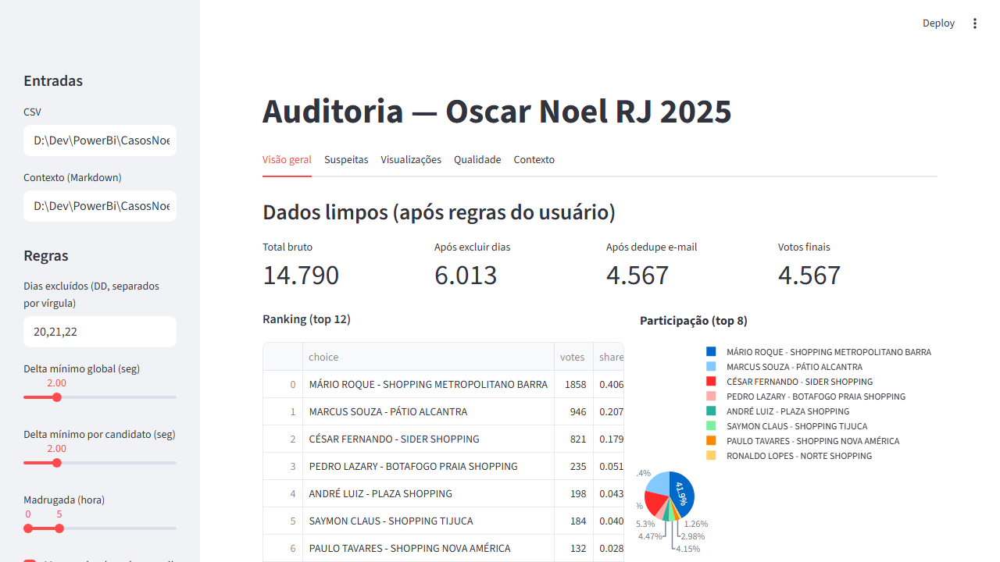
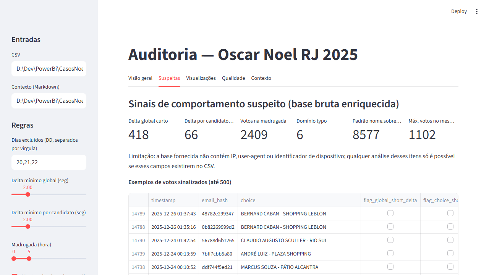
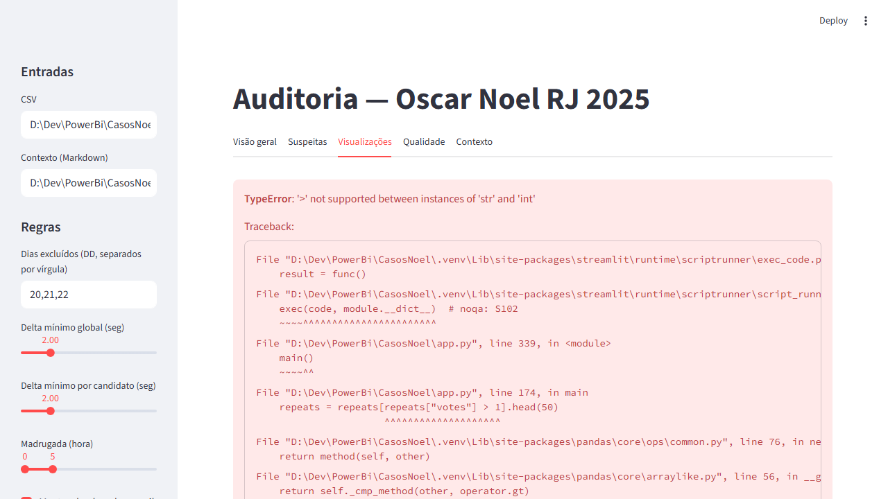

# 🔍 Auditoria de Votação — Oscar Noel RJ 2025

[](https://your-app-name.streamlit.app)
[](https://www.python.org/downloads/)
[](https://opensource.org/licenses/MIT)

Aplicação Streamlit profissional para detecção de fraude em votações online, desenvolvida para auditar uma votação de "Melhor Papai Noel" (dados anonimizados).

Este projeto demonstra técnicas avançadas de análise de dados, detecção de anomalias e visualização interativa para identificar padrões de manipulação automatizada (bots) em sistemas de votação online.

## 📊 Principais Características

- **Detecção Automática de Bots**: Identifica padrões suspeitos como emails sintéticos (`nome.sobrenome###@gmail.com`)
- **Análise Temporal**: Detecta picos anormais de votação e intervalos humanamente impossíveis
- **Comparação de Cenários**: Mostra como diferentes níveis de filtragem afetam o resultado
- **Interface Interativa**: Dashboard Streamlit com múltiplas visualizações e métricas
- **Privacidade por Design**: Hash SHA-256 de emails, sem exposição de dados pessoais
- **Análise Estatística**: Outliers por MAD z-score, distribuições temporais e geográficas

## 🎯 Objetivo

- ✅ Aplicar regras de validação e limpeza automatizada nos votos
- ✅ Evidenciar padrões de abuso (picos, intervalos curtos, horários incomuns, emails sintéticos)
- ✅ Gerar aplicação interativa para exploração e auditoria profissional
- ✅ Fornecer recomendações práticas para votações futuras

## 📁 Estrutura do Projeto

```
CasosNoel/
├── app.py                      # Aplicação Streamlit principal
├── oscar_noel_audit/           # Biblioteca core de análise
│   ├── __init__.py
│   ├── config.py              # Configurações de auditoria
│   ├── cleaning.py            # Limpeza e deduplicação
│   ├── suspicion.py           # Detecção de padrões suspeitos
│   ├── pipeline.py            # Pipeline completo de análise
│   └── io.py                  # I/O de arquivos
├── tests/                      # Testes unitários (pytest)
├── context.md                  # Análise detalhada do caso
├── requirements.txt            # Dependências Python
└── README.md                   # Este arquivo
```

## 🚀 Instalação e Execução Local

### Pré-requisitos
- Python 3.13+
- pip

### Instalação (Windows)

```powershell
# Clone o repositório
git clone https://github.com/seu-usuario/oscar-noel-audit.git
cd oscar-noel-audit

# Crie e ative o ambiente virtual
py -3.13 -m venv .venv
.\.venv\Scripts\Activate.ps1

# Atualize o pip e instale dependências
python -m pip install -U pip
pip install -r requirements.txt
```

### Instalação (Linux/Mac)

```bash
# Clone o repositório
git clone https://github.com/seu-usuario/oscar-noel-audit.git
cd oscar-noel-audit

# Crie e ative o ambiente virtual
python3 -m venv .venv
source .venv/bin/activate

# Atualize o pip e instale dependências
python -m pip install -U pip
pip install -r requirements.txt
```

### Executar a Aplicação

```bash
streamlit run app.py
```

A aplicação estará disponível em `http://localhost:8501`

## 🧪 Testes

```bash
pytest -q
```

## 💡 Como Usar

1. **Visão Geral**: Visualize o ranking e métricas após aplicação das regras básicas
2. **Insights Críticos**: Veja análise detalhada dos padrões de manipulação detectados
3. **Suspeitas**: Explore votos sinalizados e padrões de repetição
4. **Visualizações**: Analise gráficos temporais e mapas de calor
5. **Qualidade**: Revise métricas de qualidade dos dados
6. **Contexto**: Leia análise técnica completa do caso

### Ajustes Disponíveis (Sidebar)

- **Dias excluídos**: Configure quais dias remover (padrão: 20, 21, 22)
- **Delta mínimo global**: Intervalo mínimo entre votos consecutivos (segundos)
- **Delta por candidato**: Intervalo mínimo entre votos no mesmo candidato
- **Horário de madrugada**: Defina faixa de horário suspeito
- **Download**: Exporte dados limpos sem informações pessoais

## ☁️ Deploy no Streamlit Cloud

### Passo a Passo

1. **Prepare o Repositório**
   ```bash
   # Certifique-se de que o .gitignore está configurado
   # Não commite arquivos CSV com dados sensíveis!
   git add .
   git commit -m "Initial commit"
   git push origin main
   ```

2. **Acesse Streamlit Cloud**
   - Vá para [share.streamlit.io](https://share.streamlit.io)
   - Faça login com sua conta GitHub
   - Clique em "New app"

3. **Configure o Deploy**
   - **Repository**: `seu-usuario/oscar-noel-audit`
   - **Branch**: `main`
   - **Main file path**: `app.py`
   - **Python version**: 3.13

4. **Dados de Teste (Importante)**
   - O arquivo CSV original NÃO deve ser commitado (está no .gitignore)
   - **✅ O app já está configurado para upload de arquivo via interface**
   - Para demonstração pública:
     - Use a funcionalidade de upload de arquivo na sidebar
     - O arquivo será processado localmente no servidor Streamlit
     - Nenhum dado pessoal será armazenado permanentemente

5. **Deploy**
   - Clique em "Deploy!"
   - Aguarde alguns minutos para o build
   - Sua aplicação estará disponível em `https://seu-app.streamlit.app`

### Configurações Opcionais

Crie um arquivo `.streamlit/config.toml` para customizar:

```toml
[theme]
primaryColor = "#FF4B4B"
backgroundColor = "#0E1117"
secondaryBackgroundColor = "#262730"
textColor = "#FAFAFA"
font = "sans serif"

[server]
headless = true
port = 8501
```

## 📸 Screenshots

### Visão Geral


### Insights Críticos


### Análise de Suspeitas


### Visualizações Interativas


## 🔍 Principais Achados da Análise

Este projeto identificou **padrões massivos de manipulação automatizada**:

- 📧 **8.577 emails sintéticos** seguindo o padrão `nome.sobrenome###@gmail.com`
- 📊 **99,75% de concentração** desses votos em um único candidato
- 📈 **Explosão de 3.094 votos em um único dia** (21/12) com padrão suspeito
- ⏰ **Intervalos humanamente impossíveis** entre votos consecutivos
- 🔁 **1 email com 1.100+ votos repetidos** (impossível manualmente)

**Resultado**: O vencedor **muda completamente** ao remover os padrões suspeitos, passando de 40,68% para 9,29% de votos.

## 🛡️ Tecnologias Utilizadas

- **Streamlit**: Framework para aplicações web interativas em Python
- **Pandas**: Manipulação e análise de dados
- **Plotly**: Visualizações interativas
- **NumPy**: Computação numérica
- **Pytest**: Framework de testes

## 📚 Metodologia de Detecção

### Padrões Implementados

1. **Emails Sintéticos**
   - Regex: `^[a-z]+\.[a-z]+\d{3}@gmail\.com$`
   - Detecção de pool pequeno de nomes

2. **Análise Temporal**
   - Delta mínimo entre votos (global e por candidato)
   - Outliers por MAD z-score
   - Detecção de horários incomuns (madrugada)

3. **Deduplicação**
   - Remoção de emails duplicados
   - Normalização de domínios

4. **Qualidade de Dados**
   - Detecção de domínios inválidos (typos)
   - Validação de timestamps

## ⚠️ Limitações

O CSV fornecido contém apenas `timestamp`, `email` e `candidato`. **Sem IP, user-agent ou geolocalização**:

- ❌ Não é possível inferir "mesmo dispositivo" de forma defensável
- ❌ Não é possível construir mapa geográfico real
- ✅ Análise baseada em padrões de email e timing permanece robusta

## 🤝 Contribuindo

Contribuições são bem-vindas! Sinta-se à vontade para:

1. Fazer fork do projeto
2. Criar uma branch (`git checkout -b feature/NovaFuncionalidade`)
3. Commit suas mudanças (`git commit -m 'Adiciona nova funcionalidade'`)
4. Push para a branch (`git push origin feature/NovaFuncionalidade`)
5. Abrir um Pull Request

## 📄 Licença

Este projeto está licenciado sob a Licença MIT - veja o arquivo [LICENSE](LICENSE) para detalhes.

## 👤 Autor

**Seu Nome**
- GitHub: [@seu-usuario](https://github.com/seu-usuario)
- LinkedIn: [seu-perfil](https://linkedin.com/in/seu-perfil)

## 🏷️ Tags Sugeridas para GitHub

```
streamlit
data-analysis
fraud-detection
pandas
plotly
data-quality
anomaly-detection
voting-audit
bot-detection
data-science
python
portfolio-project
```

## 📞 Contato

Para dúvidas ou sugestões, abra uma [issue](https://github.com/seu-usuario/oscar-noel-audit/issues) no GitHub.

---

⭐ Se este projeto foi útil para você, considere dar uma estrela no repositório!
